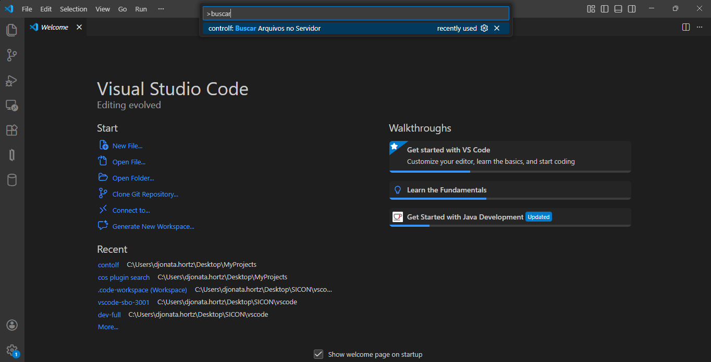
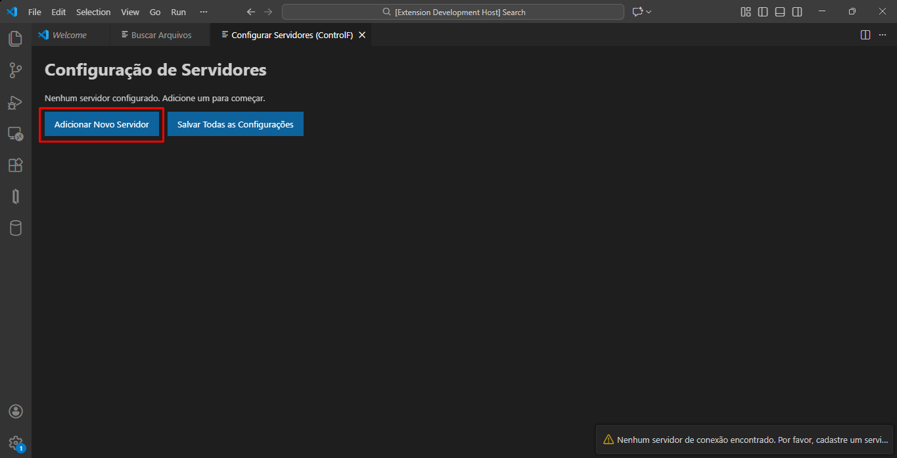
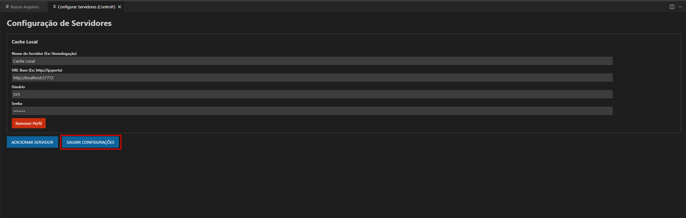
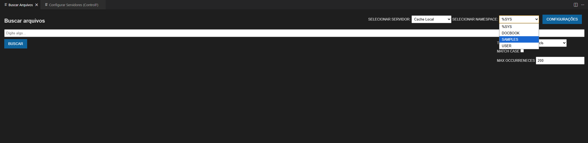
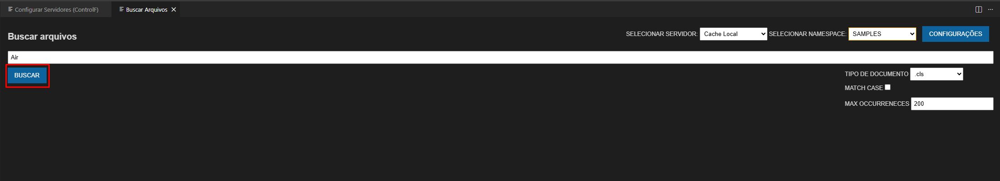
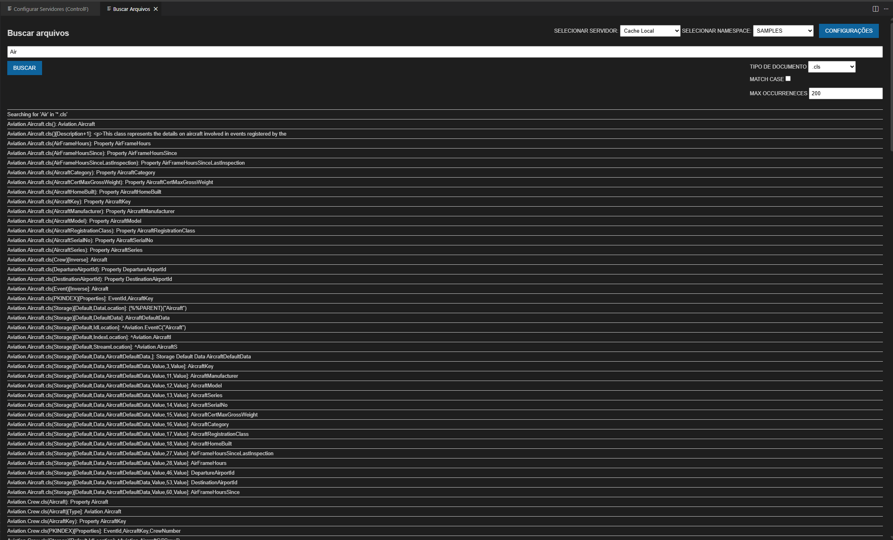

# CONTROLF Extension

## Como usar

1. Pressione `Ctrl+Shift+P` no VS Code e digite `controlf: Buscar arquivos no servidor`

2. Na primeira vez que tentar acessar a tela de busca será redirecionado para a tela configuração de servidores, e lá você deve adicionar um servidor para poder começar suas buscas.

3. Depois de preencher corretamente os campos, apenas clique em "Salvar Configurações".

4. Devolta a tela de busca, se suas configurações estiverem corretas, o campo "Selecionar Namespaces" deve trazer uma lista dos namespaces existentes naquele servidor.

5. Agora já pode digitar o que deseja buscar, depois é só clicar em "Buscar".

6. "Et voilà", sua buscar foi realizada!

**Desenvolvido por Djonata Hortz**
